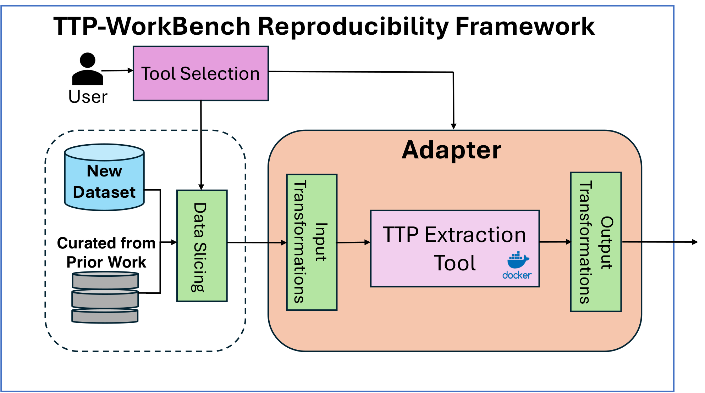

# TTP-WorkBench

**Authors:** Sean Tyler Frankum[^1], Evangelos Froudakis[^2], Athanasios Avgetidis[^2], Manos Antonakakis[^2], and Roberto Perdisci[^1]

[^1]: University of Georgia.
[^2]: Georgia Institute of Technology.

TTP-WorkBench accompanies our reproducibility study of the field of TTP Extraction from Unstructured Cyber Threat Reports.

## Abstract
In cybersecurity operations, threat reports are a valuable resource to understand emerging threats, with MITRE ATT\&CK serving as a common framework for interpreting the attacker's tactics, techniques, and procedures (TTPs) described in the reports. Manually inferring TTPs from textual reports is difficult and time-consuming, which has motivated dozens of prior studies in automated extraction and labeling approaches. However, there has been no comprehensive comparison across tools, perhaps because many open-source implementations are difficult to run, lack experimental artifacts, or do not perform well on new data. While others have pointed out these systemic obstacles to reproducibility in the broader security research community, we practically analyze and address them in the field of automated TTP extraction.

In this paper, we first analyze the TTP extraction literature through the lens of artifact reusability and then develop a reproducibility framework that directly addresses key challenges discovered while reviewing previous work. Furthermore, we create a benchmark dataset that curates existing data and adds 281 new threat reports with 4,732 TTP ground-truth labels. We demonstrate the usefulness of our reproducibility framework and benchmark dataset by adapting ten previously proposed tools. We then use the framework to reproduce key experiments published in prior work and test the tools on never-before-seen data. Our work advances the automated TTP extraction field by facilitating the reproducibility of past research and by making it easier to systematically compare future TTP extraction tools on a new benchmark dataset.

<p align="center">
  
</p>

*Figure 1: TTP-WorkBench consists of tool-specific adapters, containers, and test data, allowing researchers to select tools and slice data to run experiments in a plug-and-play fashion.*

## Citation

Until the final proceedings citation is available, please cite this work as:

> S. T. Frankum, E. Froudakis, A. Avgetidis, M. Antonakakis, and R. Perdisci, “R+R: TTP-WorkBench: A reproducibility framework and benchmark for TTP extraction from cyber threat reports,” in *Proc. 42nd Annu. Comput. Secur. Appl. Conf. (ACSAC)*, Dec. 2026, to appear.

```bibtex
@inproceedings{frankum2026ttpworkbench,
  author    = {Sean Tyler Frankum and Evangelos Froudakis and Athanasios Avgetidis and Manos Antonakakis and Roberto Perdisci},
  title     = {{R+R}: {TTP-WorkBench}: A Reproducibility Framework and Benchmark for {TTP} Extraction from Cyber Threat Reports},
  booktitle = {Proceedings of the 42nd Annual Computer Security Applications Conference (ACSAC)},
  month     = dec,
  year      = {2026},
  note      = {To appear}
}
```

## Getting Started

For development without the complete artifact setup, create a virtual
environment with Python 3.12 or later:
```
python -m venv .venv
source .venv/bin/activate
```
OR
```
conda create -n ttp-workbench python=3.12
conda activate ttp-workbench
```
Install the requirements and the Framework module:
```
pip install -e . -r requirements.txt
```

## Quick Start

```
bash quick_start.sh
```

`quick_start.sh` builds one container (rcATT) and runs a proof of concept on three reports in `Tests/poc_tests.` rcATT is one of the least resource intensive containers and faster adapters. It does not require a GPU.

## Complete Setup

For a complete project setup, which creates `.venv`, installs the framework,
builds every container, stages the original tools in native reproduction environments, and compiles the benchmark datasets and paper-reproduction inputs, run:

```bash
bash install.sh --all --engine docker
```

`install.sh` uses one monolithic `models.zip` for all large model, tool, and
saved-prediction assets. In a GitHub checkout, omitting `--models-archive`
causes the installer to read the single Zenodo URL and SHA-1 from
`artifact_sources.env`, download `models.zip` once, and stage its contents under
`Tests/Reproductions/.runtime/` for every consumer.

If `models.zip` has already been downloaded, pass it directly and no
`artifact_sources.env` download is performed:

```bash
bash install.sh --all --engine docker --models-archive /path/to/models.zip
```

The artifact package distributed through Zenodo uses this same option with the
adjacent `models.zip`, so the GitHub and artifact-package installations follow
the same staging path.

Use `--engine podman` for Podman.


## Table of works
The following are the prior works that we have adapted into TTP-WorkBench

| Adapter Name | Category | Repository | 
|------------|----------|------------------------------------------------------------------|
| TTPDrill [1]   | NLP      | [ccsnow127/TTPDrill-1.0](https://github.com/ccsnow127/TTPDrill-1.0), [SkyBulk/TTPDrill-0.3](https://github.com/SkyBulk/TTPDrill-0.3), [KaiLiu-Leo/TTPDrill-0.5](https://github.com/KaiLiu-Leo/TTPDrill-0.5) | 
| AttacKG [2] | Graph | [li-zhenyuan/Knowledge-enhanced-Attack-Graph](https://github.com/li-zhenyuan/Knowledge-enhanced-Attack-Graph/)|
| RAF-AG [3]| Graph | [cyb3rlab/RAF-AG](https://github.com/cyb3rlab/RAF-AG) | 
| Orbinato [4] | ML | [dessertlab/cti-to-mitre-with-nlp](https://github.com/dessertlab/cti-to-mitre-with-nlp.git) | 
| SeqMask [5] | ML | [MuscleFish/SeqMask](https://github.com/MuscleFish/SeqMask) | 
| LADDER [6] | Transformers | [aiforsec/LADDER](https://github.com/aiforsec/LADDER) |
| TRAM [7] | Transformers | [center-for-threat-informed-defense/tram](https://github.com/center-for-threat-informed-defense/tram.git) |
| TTP-LLM [8] | LLM | [RezzFayyazi/TTP-LLM](https://github.com/RezzFayyazi/TTP-LLM.git) | 
| Buchel [9] | LLM | [zenodo.org/records/16753555](https://zenodo.org/records/16753555) | 
| rcATT [10] | Hybrid | [vlegoy/rcATT](https://github.com/vlegoy/rcATT.git) | 

## Project Layout
- Datasets: contains the code to compile the dataset from the data in prior work projects and the author-labeled reports we manually reviewed
- Docker_Setup: contains the code to setup each of the docker containers for the ten tools adapted into TTP-WorkBench
- Framework: contains the adapters for each of the ten tools, as well as several utilities we use throughout the project
- Tests: proof-of-concept, paper-reproduction, and benchmark-evaluation runners
- claims: the concise claim-to-evidence index and its end-to-end report builder


## Requirements

The complete setup and reproduction suite requires:

- A Linux x86-64 host with at least 100 GiB of free storage before bootstrap;
  substantially more space is recommended for container images, environments,
  model weights, and retained outputs.
- Docker with Compose, or Podman with Compose. GPU experiments additionally
  require an NVIDIA GPU and current NVIDIA container support (the NVIDIA CDI
  device when using Podman).
- Python 3.12 or later, Git, curl, unzip, rsync, `sha256sum`, Java, and Conda or
  Mamba.
- Internet access to GitHub, Zenodo, package indexes, Hugging Face, TensorFlow
  Hub, Ollama model retrieval, and the OpenAI API.

Two adapters have experiment-specific requirements:

- The Büchel adapter requires NVIDIA CUDA for its GPU paths. We used two
  NVIDIA A40 GPUs for the full experiments, which prevented out-of-memory
  errors during supervised fine-tuning. CPU-only reproduction selections can
  omit Büchel inference.
- TTP-LLM requires an OpenAI API key for an account that can access the
 `gpt-3.5-turbo` model. For `--core` and `--all`, `install.sh`
  explains how to create a project key, prompts for it without echoing it, and
  saves it in the ignored root `config.ini` with mode `0600`. During
  development, the smoke test cost less than US$0.05 and a full comparison
  cost approximately US$1.00; budget US$1.50 conservatively for the core claims
  plus the all-adapter smoke tests. A full Table 2 comparison makes 9,532
  requests through each of its original and framework paths (19,064 total,
  plus smoke-test calls). Check the account's requests-per-day limit before
  starting. If it is lower, resume the same claims run after the quota window
  resets rather than restarting it.

Several tools take considerable time to process every report in every
experiment. The Büchel and Orbinato containers use trained models supplied
with the reproduction artifacts, so the standard reproduction flow does not
retrain them.

## Building Containers
The 'Docker_Setup' Directory contains sub-directories with a Dockerfile for each prior work that we adapt into TTP-WorkBench. The lone exception is the Buchel adapter, which contains a shell script that downloads and builds the images provided in [9].

If needed, download and install [Docker at https://www.docker.com/](https://www.docker.com/) or [podman](https://podman.io). 

Run the docker setup script (see the --help for additional options). The script builds the docker images from our Dockerfiles and runs the Buchel setup script that modifies their Docker compose script to suit our adapter setup.
```
cd Docker_Setup
bash setup_containers.sh --engine docker --all
```

The Docker_Setup directory contains a record of all the changes we made in order to bring the original authors' code bases to working states. Each subdirectory contains files that build the tool's image. The Dockerfile specifies the image build through setup instructions, including cloning the tool's repository at a specific commit and targeted edits to project files. If needed, we also created CLI scripts that are also included in the directory and copy to the image at build time. 


## Datasets
We include two major categories of data: the data from prior work that we curate into our common schema and the additiional ground truth that we provided to compare the tools on never-before-seen data. The author-labeled data is derived by leveraging the TTP codes that authors provide in threat reports they publish. The dataset is compiled in the `install.sh` path. Ad hoc compilation relies on completing the docker setup first, because we copy data out of the respective containers.:
```
python Datasets/compile_data.py
```


## Proof of Concept Tests
Under Tests/poc_tests are several threat reports and a script to test the plug and play nature of the framework. Note the small function that predicts the text with the only difference throughout the ten tools being the actual adapter that is loaded. Please complete the Docker Setup first. 

To run the proof-of-concept tests:
```
python Tests/poc_tests/run_poc_tests.py --engine podman --adapter all
```

Each adapter as a `main` function that predicts on one of these files as an example of using the predict_texts() function. This means you can run a simple test by just running the adapter on it's own. For instance, to test TTPDrill on a test file:
```
python Framework/adapters/ttpdrill_adapter.py
```


## Licensing

Project-authored software and documentation are released under the
[Apache License 2.0](LICENSE). The common-record schema, author-created
benchmark annotations, labels and structured metadata, and the authors'
selection, normalization, and arrangement of compiled datasets are released
under [CC BY-SA 4.0](DATA_LICENSE.md). Third-party software, models, datasets, MITRE
ATT&CK content, and cyber threat report text retain their own terms; see
[THIRD_PARTY_NOTICES.md](THIRD_PARTY_NOTICES.md) and the per-tool documentation.


## References
[1] G. Husari, E. Al-Shaer, M. Ahmed, B. Chu, and X. Niu, “TTPDrill: Automatic and accurate extraction of threat actions from unstructured text of CTI sources,” in *Proc. 33rd Annu. Comput. Secur. Appl. Conf. (ACSAC)*, 2017, pp. 103–115.

[2] Z. Li, J. Zeng, Y. Chen, and Z. Liang, “AttacKG: Constructing technique knowledge graph from cyber threat intelligence reports,” in *Proc. Eur. Symp. Res. Comput. Secur. (ESORICS)*, 2022, pp. 589–609.

[3] K. Mai, J. Lee, R. Beuran, R. Hotchi, S. E. Ooi, T. Kuroda, and Y. Tan, “RAF-AG: Report analysis framework for attack path generation,” *Computers & Security*, vol. 148, Art. no. 104125, 2025.

[4] V. Orbinato, M. Barbaraci, R. Natella, and D. Cotroneo, “Automatic mapping of unstructured cyber threat intelligence: An experimental study (practical experience report),” in *Proc. 33rd IEEE Int. Symp. Softw. Rel. Eng. (ISSRE)*, 2022, pp. 181–192.

[5] W. Ge and J. Wang, “SeqMask: Behavior extraction over cyber threat intelligence via multi-instance learning,” *The Computer Journal*, vol. 67, no. 1, pp. 253–273, Nov. 2022.

[6] M. T. Alam, D. Bhusal, Y. Park, and N. Rastogi, “Looking beyond IOCs: Automatically extracting attack patterns from external CTI,” in *Proc. 26th Int. Symp. Res. Attacks, Intrusions Defenses (RAID)*, 2023, pp. 92–108.

[7] MITRE, “Threat Report ATT&CK Mapper (TRAM),” 2023. [Online]. Available: <https://github.com/center-for-threat-informed-defense/tram/>. [Accessed: Apr. 30, 2025].

[8] R. Fayyazi, R. Taghdimi, and S. J. Yang, “Advancing TTP analysis: Harnessing the power of large language models with retrieval augmented generation,” in *Proc. Annu. Comput. Secur. Appl. Conf. Workshops (ACSACW)*, 2024, pp. 255–261.

[9] M. Büchel, T. Paladini, S. Longari, M. Carminati, S. Zanero, H. Binyamini, G. Engelberg, D. Klein, G. Guizzardi, M. Caselli, A. Continella, M. van Steen, A. Peter, and T. van Ede, “SoK: Automated TTP extraction from CTI reports—Are we there yet?” in *Proc. 34th USENIX Secur. Symp.*, 2025.

[10] V. Legoy, M. Caselli, C. Seifert, and A. Peter, “Automated retrieval of ATT&CK tactics and techniques for cyber threat reports,” arXiv:2004.14322, 2020.

[11] L. Lange, M. Müller, G. Haratinezhad Torbati, D. Milchevski, P. Grau, S. C. Pujari, and A. Friedrich, “AnnoCTR: A dataset for detecting and linking entities, tactics, and techniques in cyber threat reports,” in *Proc. Joint Int. Conf. Comput. Linguistics, Lang. Resources Eval. (LREC-COLING)*, 2024, pp. 1147–1160.
