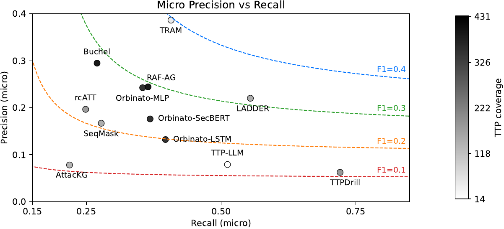
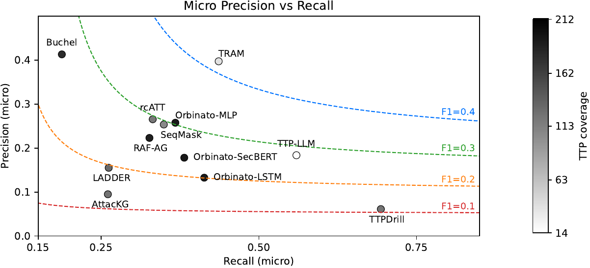
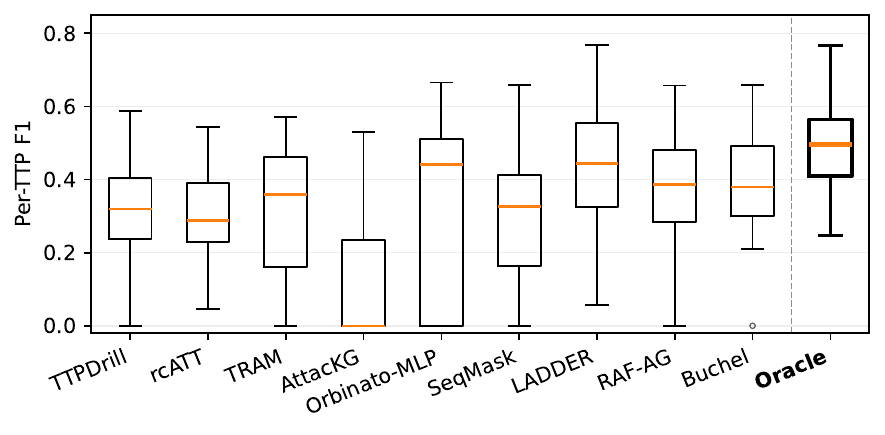
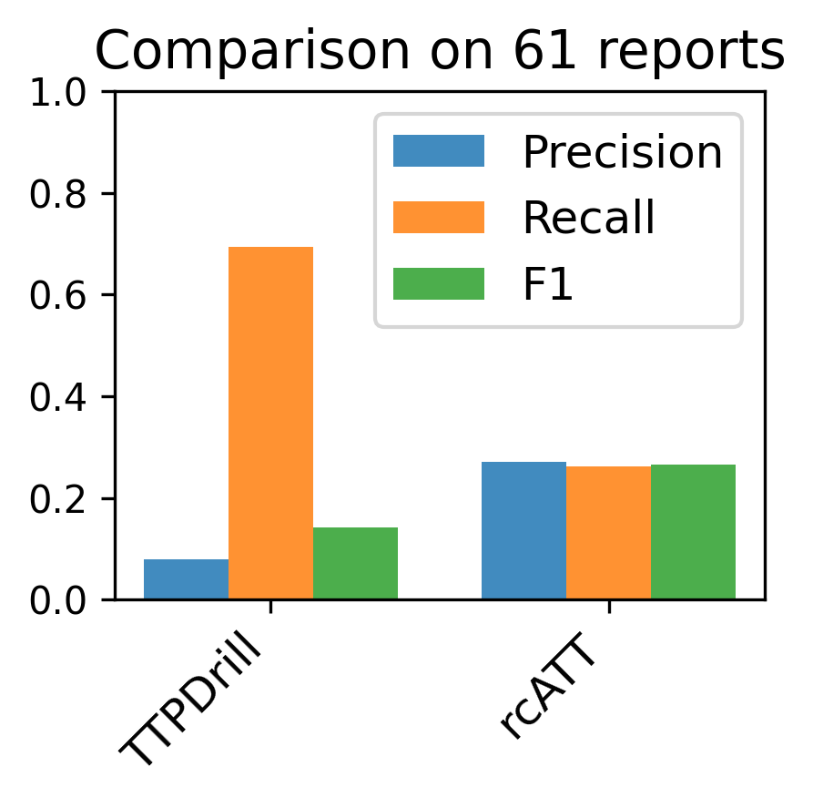
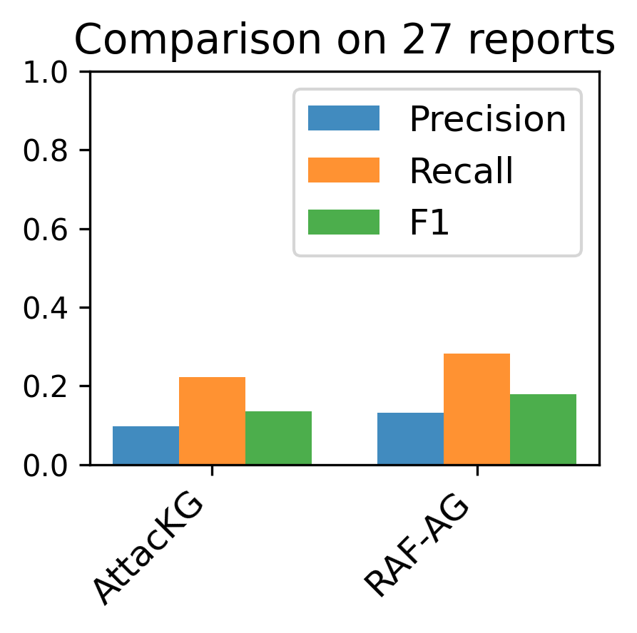
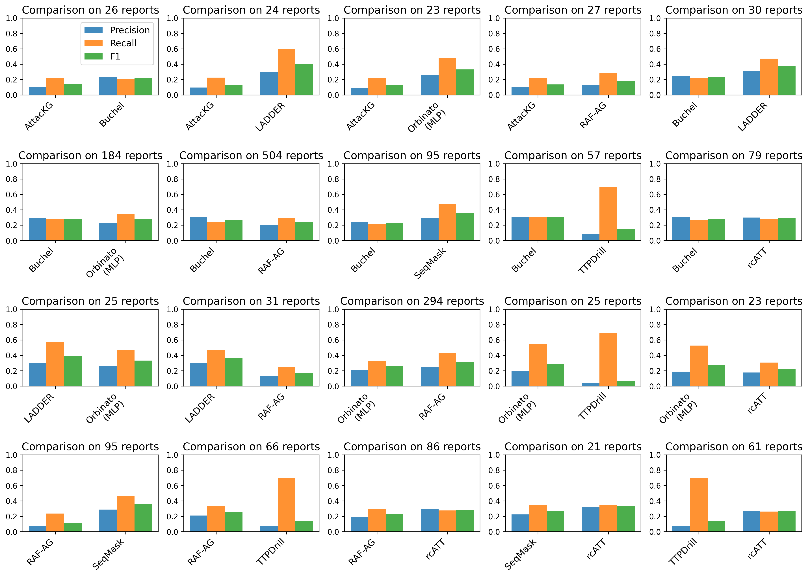

# Benchmark figure reproduction results

This analysis regenerates Figures 4--6 and 8 from the saved benchmark predictions. The paper figures are fixed references; the fresh figures are recomputed from the same prediction archive against the currently compiled ground truth. No model inference is performed.

## Evaluation scope and pass criteria

Claim 3 reconstructs the benchmark analysis from the predictions used in the submitted paper rather than rerunning the complete benchmark inference workload. A fresh sequential run would execute ten tools, including three Orbinato model configurations, on 281 author-labeled and 426 curated reports. Based on our benchmark runs, this would take roughly 18 days. Claim 1 exercises all ten integrations, and Claim 2 reruns selected experiments end to end, so Claim 3 focuses the evaluator workload on reconstructing and reviewing the complete benchmark analysis.

Claim 3 records `PASS` when all 38 preserved files pass archive verification, the capacity-aware evaluation completes, Figures 4--6 and 8 are reconstructed, and the direct-comparison queues contain 61 reports for TTPDrill versus rcATT and 27 reports for AttacKG versus RAF-AG. Visually compare each paper reference with its fresh result and confirm that they show similar results, including the same relative tool performance and overall patterns. The plotting style does not need to match exactly.

## Run conditions

| Figure | Data and queue | Evaluation |
|---|---|---|
| 4(a) | 281 author-labeled CTRs | Micro precision/recall/F1; discard codes not in the tool's TTP capacity |
| 4(b) | Never-before-seen curated prior-work CTRs; rcATT-derived ground truth excluded | Micro precision/recall/F1; discard codes not in the tool's TTP capacity |
| 5 | Combined benchmark; support >= 50; TTP in at least three tools' capacities; TTP-LLM excluded because it predicts tactics only | Per-TTP F1 and best-tool oracle |
| 6 | TTPDrill/rcATT and AttacKG/RAF-AG direct queues | Micro precision/recall/F1 on the joint-capacity report intersection; previously seen reports excluded |
| 8 | All direct tool pairs with at least 10 eligible reports | Micro precision/recall/F1 on each joint-capacity report intersection; previously seen reports excluded |

As stated in the submission, a direct comparison evaluates tools only on reports whose ground-truth TTP set is within the intersection of the tools' TTP capacities, while resolving updated TTP codes and excluding reports previously seen by either tool.

## Input verification

- Archive: `benchmark_results.zip`
- SHA-256: `1a17e0a9a2c0856455d352350e01057eae313c86bbb4dc58491dedd57b05f8ae`
- Verified archive files: 38
- The archive and materialized files passed verification.

The archived prediction and evaluation files used to generate the paper figures were verified before the figures were regenerated.

## Direct queue checks

- TTPDrill vs rcATT: 61 reports (paper: 61).
- AttacKG vs RAF-AG: 27 reports (paper: 27).

## Paper reference and fresh result

| Figure | Paper reference | Fresh reproduction |
|---|---|---|
| 4(a) |  |  |
| 4(b) |  |  |
| 5 |  |  |
| 6(a) |  |  |
| 6(b) |  |  |
| 8 |  |  |

Commands and console output are retained in `reproduced_figures/run.log`.
